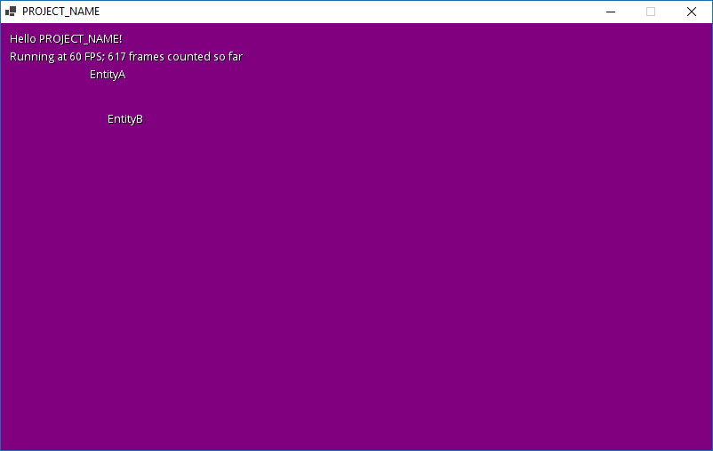

Protogame Blank Template
================================

This template implements an empty game in Protogame.  It covers the following topics:

- How to define a basic game and world in Protogame
- How to define a basic entity
- How to define an entity factory

Getting Started
------------------

This template is available in the Protobuild Manager.  You can also create this template from the command-line with:

```
Protobuild.exe --start https-git://www.github.com/RedpointGames/Protogame.Template.Blank
```

Just download [Protobuild.exe](https://github.com/Protobuild/Protobuild/raw/master/Protobuild.exe) and place it in an empty folder where you want to create your project.

Screenshot
--------------


